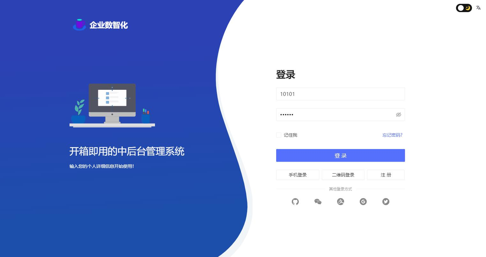
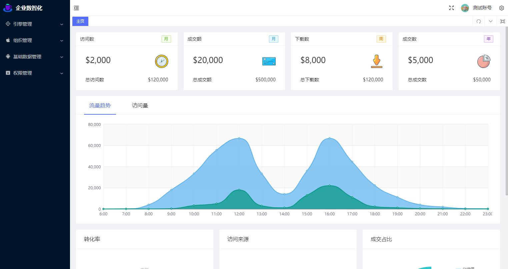
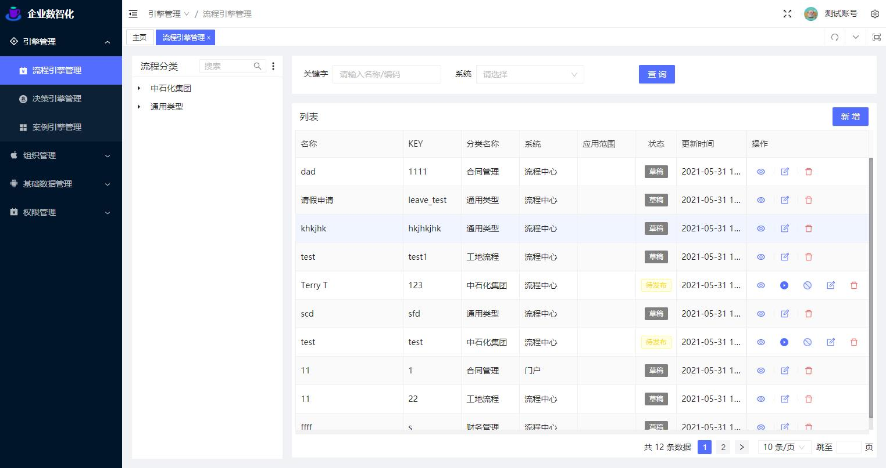
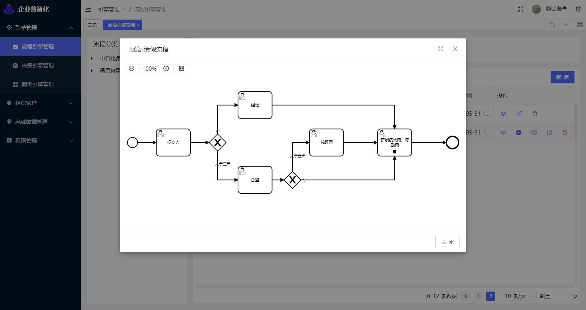
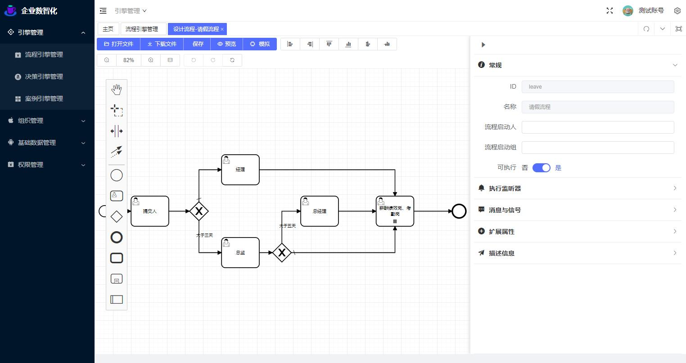

## 预览
- [企业数智化](http://8.129.209.112:8100/idm/#/login)
- [企业数智化门户](http://8.129.209.112:8200/idm/#/login)







## 后台安装
1、安装数据库
新建一个数据库flow
导入数据库脚本：docs/sql/flow.sql

2、配置数据源
修改flow-admin模块下的resources配置文件application-local.properties
```
spring.datasource.druid.url=jdbc:mysql://localhost:3306/flow?autoReconnect=true&useUnicode=true&characterEncoding=utf8&zeroDateTimeBehavior=CONVERT_TO_NULL&useSSL=false&serverTimezone=GMT%2B8&nullCatalogMeansCurrent=true
spring.datasource.druid.username=xxxx
spring.datasource.druid.password=xxx
```
3、启动应用程序
flow-admin模块下的com.dragon.flow.main.FlowAdminApplication

直接运行即可

4、访问路径
http://localhost:8988/login/index.html
账号密码：

普通管理员：10101/888888
超级管理员：10100/888888
5、预览


## 前台安装
1、配置数据源
修改flow-front-rest模块下的resources配置文件application-local.properties
```
spring.datasource.druid.url=jdbc:mysql://localhost:3306/flow?autoReconnect=true&useUnicode=true&characterEncoding=utf8&zeroDateTimeBehavior=CONVERT_TO_NULL&useSSL=false&serverTimezone=GMT%2B8&nullCatalogMeansCurrent=true
spring.datasource.druid.username=xxxx
spring.datasource.druid.password=xxx
```

2、启动应用程序
flow-front-rest模块下的com.dragon.flow.main.FlowFrontApplication

3、访问路径
http://localhost:8990

4、登录账号密码

账号：10000到10100 密码统一：888888


## 捐赠
如果您认为该项目对您有所帮助，则可以帮助作者购买一杯咖啡，以表示支持！

