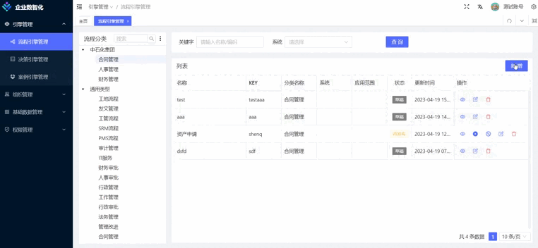
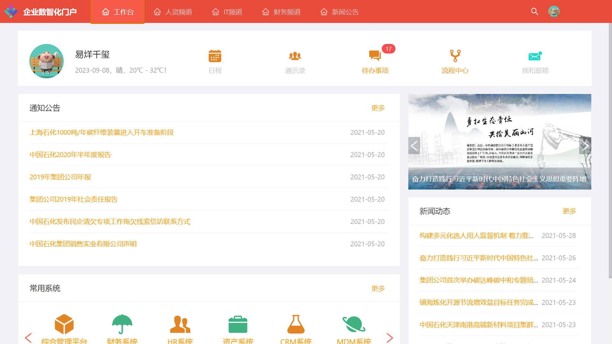
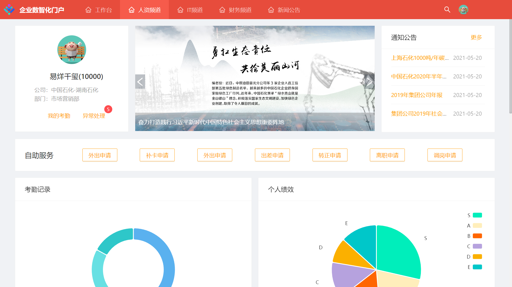

<div align="center"> <a href="https://github.com/wansenai/flow">  </a> <br> <br>

[](LICENSE)

<h1>Flow (企业级流程中心)</h1>
</div>

**中文** | [English](./README.md)

## 简介
Flow 是一个免费开源的企业级流程应用，结合了`Flowable`,`Bpm.js`,`Java`,`Vue3`,`TypeScript`等主流技术开发，开箱即用的流程引擎一体化解决方案。

## 预览
- [企业数智化 - 流程中心](http://47.106.196.177:8100/idm/#/login?_blank)
- [企业数智化 - 门户](http://47.106.196.177:8200/idm/#/login)
- [操作演示 - 流程中心](https://www.bilibili.com/video/BV1qU4y1L7pB/)
- [操作演示 - 门户](https://www.bilibili.com/video/BV1mh411Y7UT/)
- [Gitee](https://gitee.com/lwj/flow)
- [GitHub](https://github.com/ecnice/flow)
### 流程后台-表单设计

### 流程后台-流程设计


### 门户前台



#
#


## 后台安装
1、安装数据库
新建一个数据库flow
导入数据库脚本：docs/sql/flow.sql

2、配置数据源
修改flow-admin模块下的resources配置文件application-local.properties
```
spring.datasource.druid.url=jdbc:mysql://localhost:3306/flow?autoReconnect=true&useUnicode=true&characterEncoding=utf8&zeroDateTimeBehavior=CONVERT_TO_NULL&useSSL=false&serverTimezone=GMT%2B8&nullCatalogMeansCurrent=true
spring.datasource.druid.username=xxxx
spring.datasource.druid.password=xxx
```
3、启动应用程序
flow-admin模块下的com.dragon.flow.main.FlowAdminApplication

直接运行即可

4、访问路径
http://localhost:8988/index.html
账号密码：

普通管理员：10101/888888
超级管理员：10100/888888

5、项目结构


6、开放接口
http://localhost:8988/swagger-ui/index.html


## 前台安装
1、配置数据源
修改flow-front-rest模块下的resources配置文件application-local.properties
```
spring.datasource.druid.url=jdbc:mysql://localhost:3306/flow?autoReconnect=true&useUnicode=true&characterEncoding=utf8&zeroDateTimeBehavior=CONVERT_TO_NULL&useSSL=false&serverTimezone=GMT%2B8&nullCatalogMeansCurrent=true
spring.datasource.druid.username=xxxx
spring.datasource.druid.password=xxx
```

2、启动应用程序
flow-front-rest模块下的com.dragon.flow.main.FlowFrontApplication

3、访问路径
http://localhost:8990

4、登录账号密码

账号：10000到10100 密码统一：888888

## Docker 启动
https://gblfy.blog.csdn.net/article/details/117636550
镜像的密码是flow

## 社区 

### 加入QQ群
输入群号：633168411 或扫码加入QQ群


### 加入微信群

扫码加入微信群，若提示二维码过期请添加微信号：wansensoft 备注Flow开源，谢谢！

<image src="https://wansen.cloud/group1/default/20231227/18/46/4/%E5%BE%AE%E4%BF%A1%E5%9B%BE%E7%89%87_20231227184637.jpg?download=0" alt="微信群" width="300"/>

## 好书推荐
大家在使用本项目时，推荐结合贺波老师的书[《深入Activiti流程引擎：核心原理与高阶实战》](https://item.m.jd.com/product/13928958.html?gx=RnAomTM2bmCImZxDqYAkVCoIHuIYVqc)，这本书对系统学习和深入掌握Activiti/Flowable的用法非常有帮助。


<image src="https://github.com/didi/LogicFlow/assets/8553969/f4492e40-d812-453e-a170-38fb4253338f" alt="《深入Activiti流程引擎：核心原理与高阶实战》" width="250"/>

## 协议

- 遵循 MIT 和 Apache-2.0 协议
- 请自由地享受和参与开源

